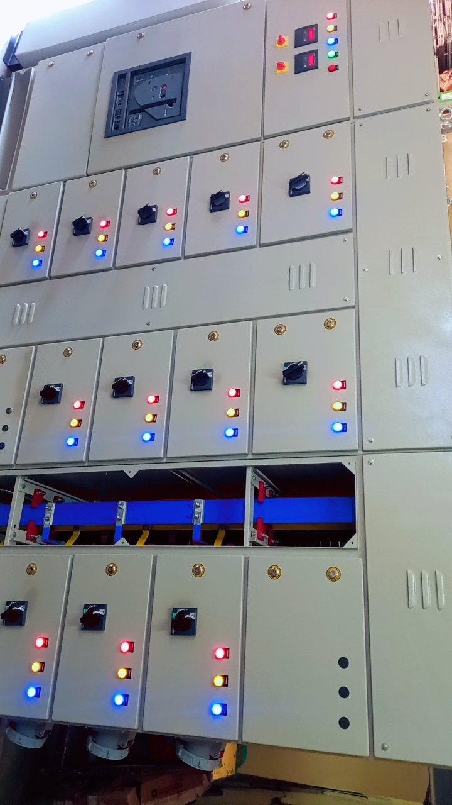

Main LT panel (Load Tension Panel) is an essential electrical distribution equipment used in industries and power distribution systems. It consists of various components, including incoming feeders, ACB (Air Circuit Breaker), MCB (Miniature Circuit Breaker), and busbars. The panel receives power from transformers and distributes it to sub-LT panels, ensuring proper power supply to connected loads. Proper functioning of the LT panel is crucial to maintain efficient and reliable power distribution

   
  
  

<i>Main LT Panel and Component Wiring (Lechler India Internship)</i>

